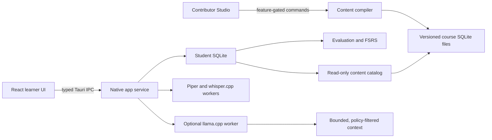

# Architecture and ownership

Fluenta is one local application with independent domain crates. There is no PostgreSQL,
local HTTP server, login service, or remote state. Tauri IPC calls Rust functions inside
the app. Native ML engines run as supervised child processes and communicate through
bounded local files. All installed learning works without network access.

## Boundaries that matter

`contracts` contains values, validation and schemas. It depends on neither Tauri nor
the databases. React imports its generated TypeScript; it never maintains a second
definition of an activity or authoritative grading logic. Update Rust types, regenerate
schemas and TypeScript with `npm run contracts`, and commit both generated outputs.

`content` compiles and reads authored facts. `learning` decides correctness and review
evidence. `storage` coordinates those decisions in SQLite transactions. `speech` and
`tutor` cannot call student database mutations. The Tauri service constructs the context,
checks session policy and stores the resulting evidence. React supplies an answer, not a
score or an evidence classification.

The application layer has one short-lived mutex around its SQLite connection/catalog.
No synthesis, recognition, generation, HTTP download, or archive compression waits under
that mutex. This is an intentional single-learner process, not a hosted multi-user service.
Keep slow work in supervised operations instead of introducing a second stateful backend.

Student writes use WAL with `synchronous=FULL`, so each committed update requests a
durability flush. This still depends on the disk and operating system honoring it.

## A lesson submission

1. Rust selects authored activities and stores their release ID, source language,
   randomized options, positions and answer-free views in a durable session.
2. UI drafts carry a monotonically increasing sequence. Old saves cannot overwrite a
   newer draft. Closing a lesson window flushes the current draft.
3. Submission carries the session, step, version and a mutation nonce. An immediate
   SQLite transaction checks those values, evaluates the pinned activity, records the
   attempt and advances the phase. Retrying the same submission returns its receipt.
4. Hints, references, edited ASR and assisted recall retain different evidence. Voice
   recognition never earns spelling evidence. Writing and open speaking receive authored
   rubrics and an honest self-review outcome.
5. FSRS schedules eligible short-answer practice. A choice click, an explanation page,
   a generated tutor reply or a checkpoint answer cannot impersonate unaided recall.

Checkpoints select held-out authored tasks, pin a deadline, cap audio replays, block
reference/tutor access in Rust, and defer feedback until the recap. They are practice
assessments on a user's own computer, not a tamper-proof examination platform.

## Content and scale

Authors edit reviewable JSON fragments. Spanish text, speech segments and answer policies
are shared; English and German teaching text resolves through explicit translation slots.
The compiler emits a content-addressed SQLite pack per course and teaching language.
Pack entities have indexed `(id, revision)` keys; relationships have a reverse index;
reference search uses FTS5; lesson overviews are compiled without answer keys.

Search and unit listing return bounded pages with keyset cursors. A cursor binds to its
query and active release set. Practice uses an indexed objective relationship to select
up to 15 suitable activities. The learner never downloads or opens a directory of JSON
files during a lesson. Immutable old packs remain available to sessions pinned to them.

The home view still loads the installed unit/lesson metadata together. This is inexpensive
for the current curriculum; the 50,000-entry benchmark concerns **reference materials**,
not 50,000 rendered lesson cards. A catalog of that many lessons requires using the
existing paged unit API and list virtualization in the course view. Add that UI when
publishing a catalog of that size; it is not claimed as measured today.

## Updates and recovery

Course archives carry an Ed25519 signature over the exact release manifest. Import
verifies the signature, flat filenames, sizes, SHA-256 values, SQLite integrity and
revision compatibility before activation. A monotonic release sequence prevents an
older imported release from replacing the same course. Newer bundled course revisions
take precedence over older imported revisions. The completed catalog is validated before
its activation is written to SQLite. Old packs are retained for pinned sessions.

Manual backups include the online SQLite snapshot, courses and learner recordings.
Restore validates a staged replacement before modifying progress and writes a portable
`recovery.fluenta` first. Healthy daily database snapshots retain seven launch days;
startup recovery preserves damaged database/WAL files before an explicitly chosen restore.

## Security and extension rules

- Curriculum is data: no HTML execution, JavaScript, SQL, MDX or downloadable plugins.
- Native commands accept logical IDs, not arbitrary executable or database paths.
- The learner webview has no generic filesystem or shell capability. Its CSP blocks
  external scripts, frames and web network calls.
- User-selected archive paths pass native validation. ZIP traversal, duplicate entries,
  symlinks, decompression budgets and digest mismatches are rejected.
- Keep the content signing private key out of Git. The compiled public key is intentional.
- An exercise family is added through its authored type, answer-free view, compiler
  validation, evaluator/evidence rules, renderer and a meaningful end-to-end case.
  Do not put a special-case answer checker in a React component.
- Database schema versions, protocol versions, content revisions and release sequences
  are different values. A future student migration must be transactional, preserve old
  records and have a real upgrade fixture. Unknown versions currently fail explicitly.

The optional tutor is not a security boundary for correctness: its output remains
untrusted teaching assistance. Context selection and reference access are enforced by
code; prompt text alone is never used to protect checkpoint answers.
Retrieval ranks matches across the learner's meaningful query terms and supplies bounded
authored excerpts. The constrained response schema allows only the supplied reference IDs;
empty reference sets force an empty citation list. Prior assistant turns retain both the
Spanish reply and native explanation. JSON field lengths and the output token budget are
bounded together. One short locale/mode example demonstrates the response format.
Presets select conversation or explanation mode explicitly. The prompt names the
explanation language, and the schema requires a nonempty explanation outside conversation mode.
Whatlang checks explanation language locally. A confidently different language triggers
one translation pass through the same model; the Spanish reply and validated citations
are preserved. The repair is checked again and shares the original cancellation token
and deadline. No cloud translation service or additional model is used.
